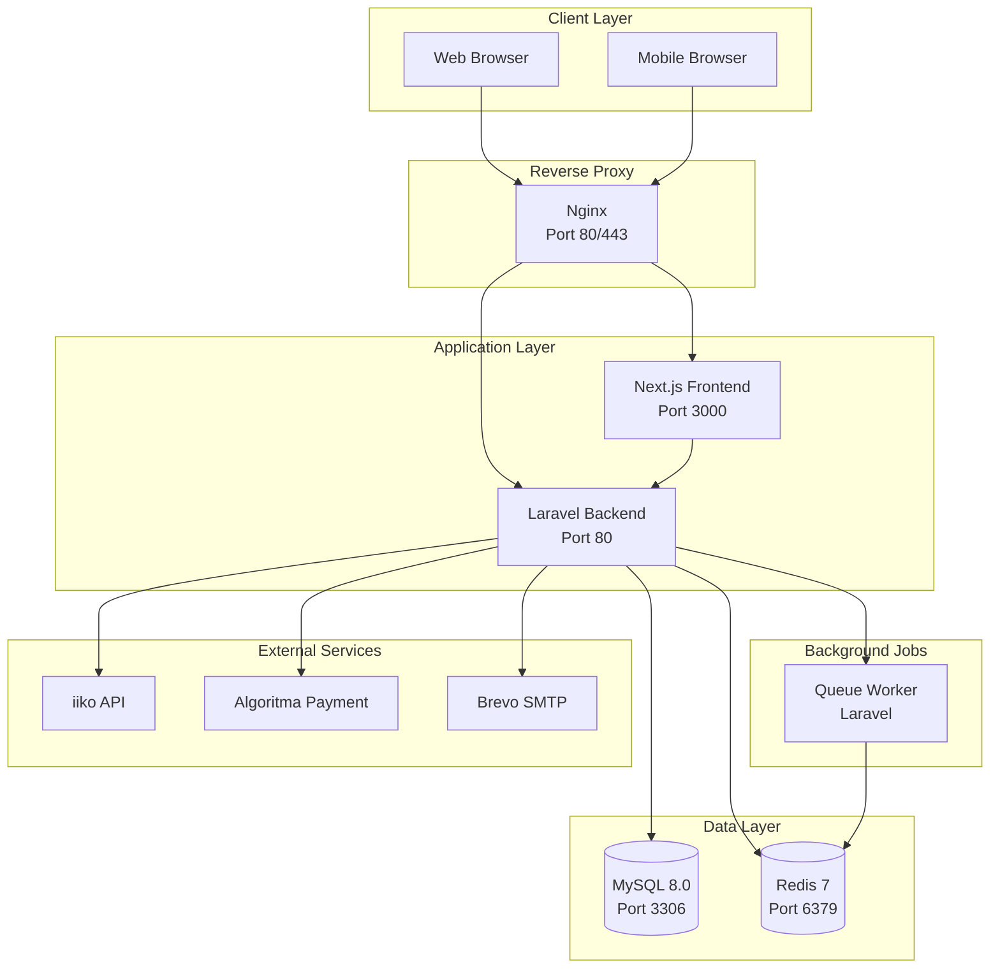
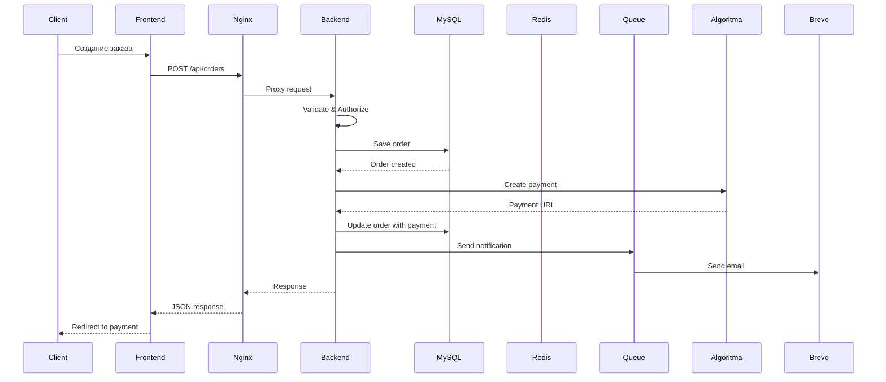
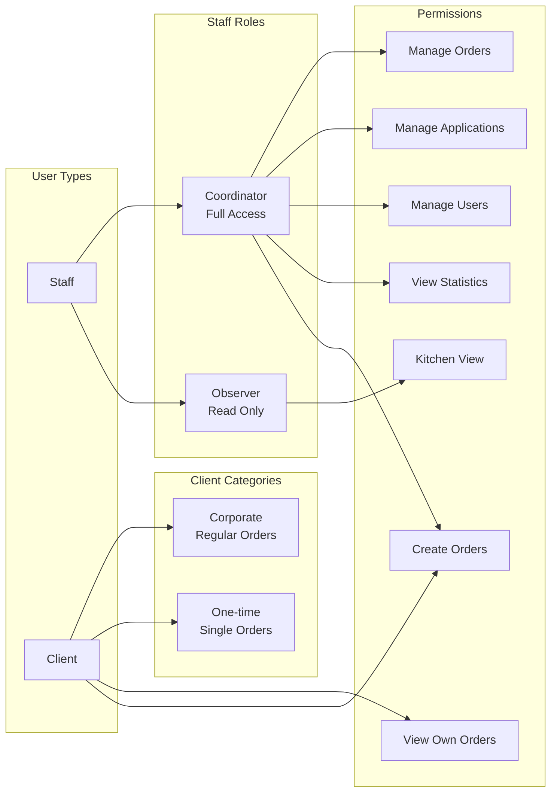
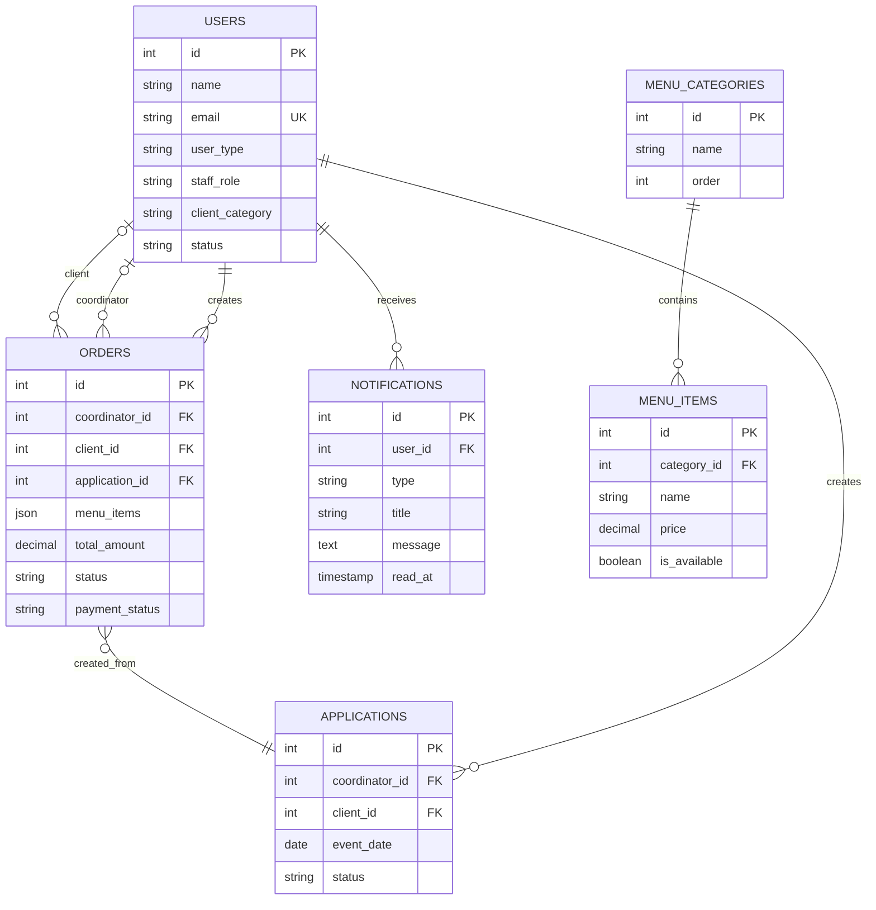
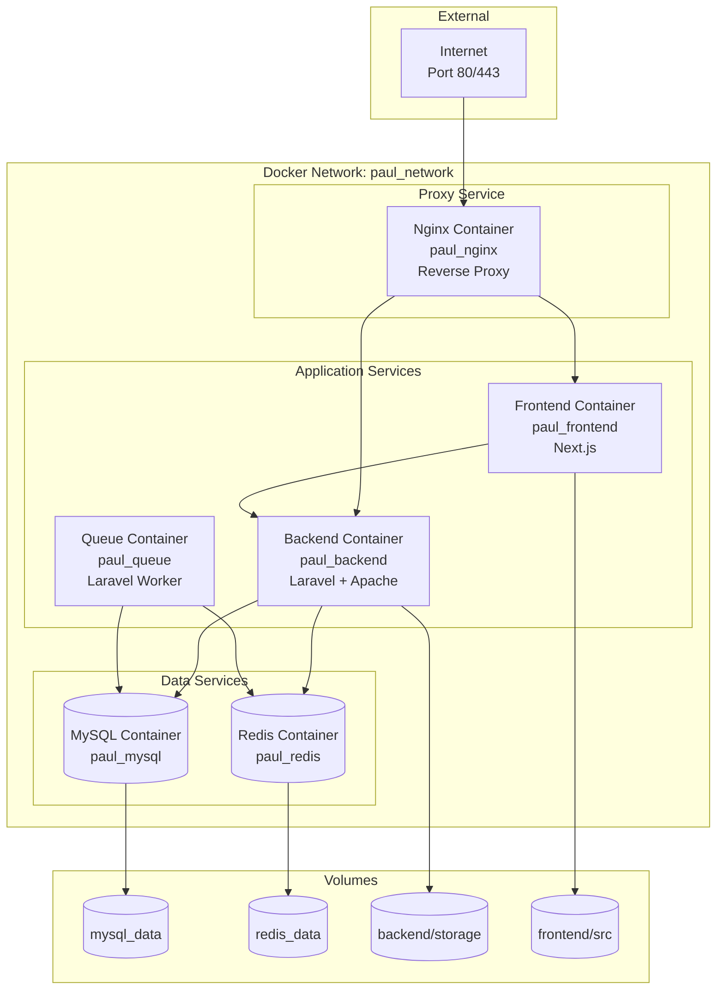
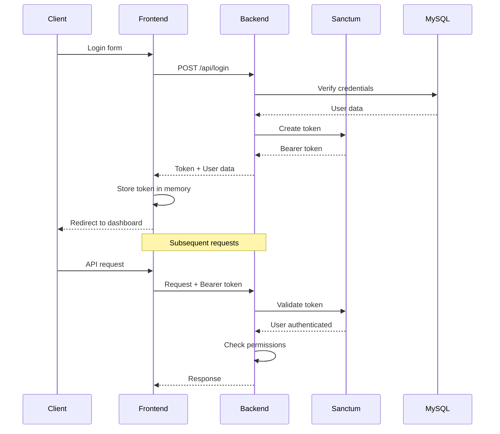
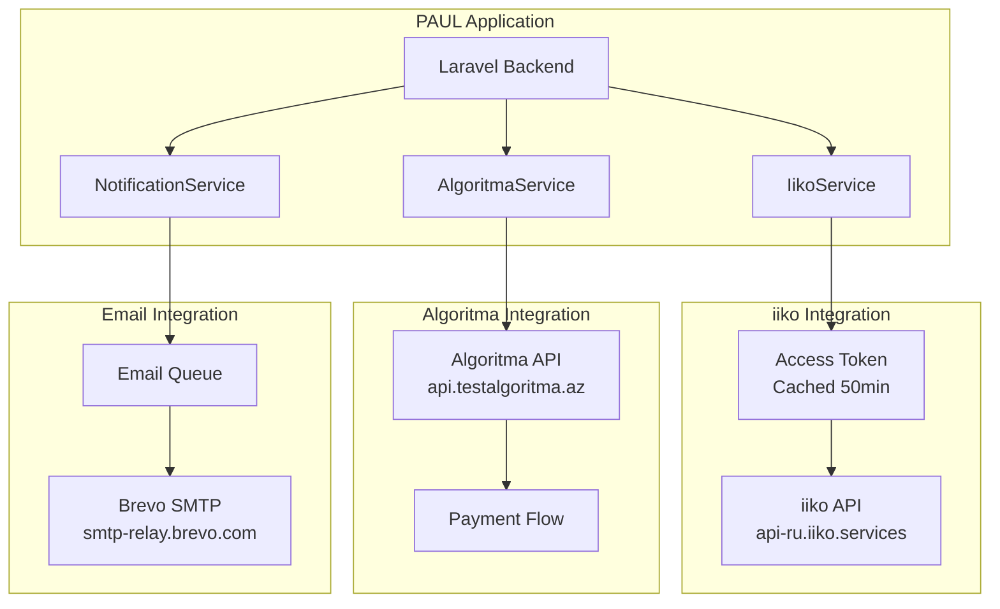
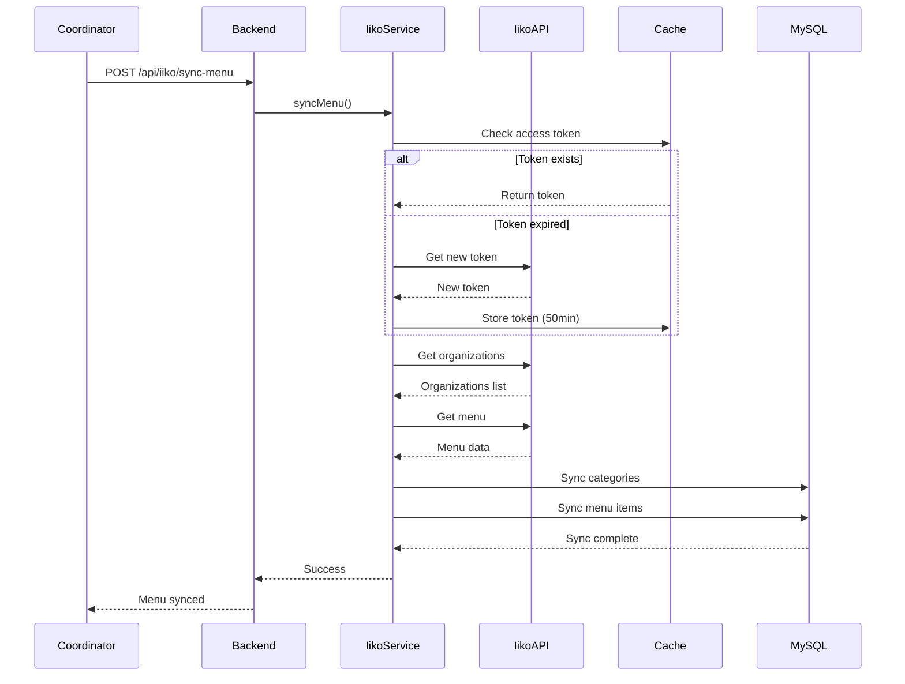
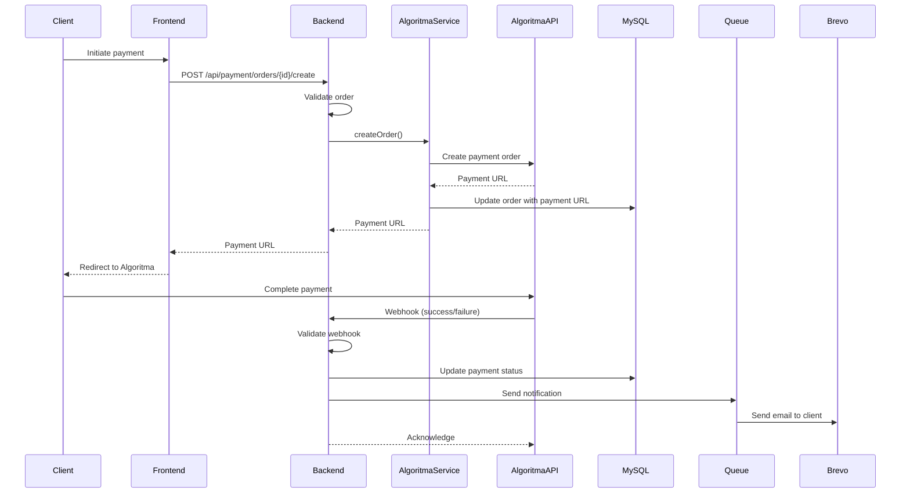

# 🏗️ Архитектурные диаграммы проекта PAUL Azerbaijan

## Общая архитектура системы

## Поток данных при создании заказа

## Система ролей и прав доступа

## Структура базы данных (основные таблицы)

## Docker Compose архитектура

## Поток аутентификации

## Интеграция с внешними сервисами

## Процесс синхронизации меню с iiko

## Процесс обработки платежа

---

## Легенда

**Цвета и стили:**
- 🔵 Синий - Клиентский слой
- 🟢 Зеленый - Приложение
- 🟡 Желтый - Данные
- 🟠 Оранжевый - Внешние сервисы
- 🔴 Красный - Критичные компоненты

**Типы связей:**
- `-->` - HTTP запрос
- `-->>` - Ответ
- `||--o{` - One-to-Many
- `}o--||` - Many-to-One
- `}o--o|` - Optional relationship

---

**Примечание:** Для просмотра Mermaid диаграмм используйте:
- GitHub (автоматически рендерится)
- VS Code с расширением Mermaid
- Онлайн редактор: https://mermaid.live/
